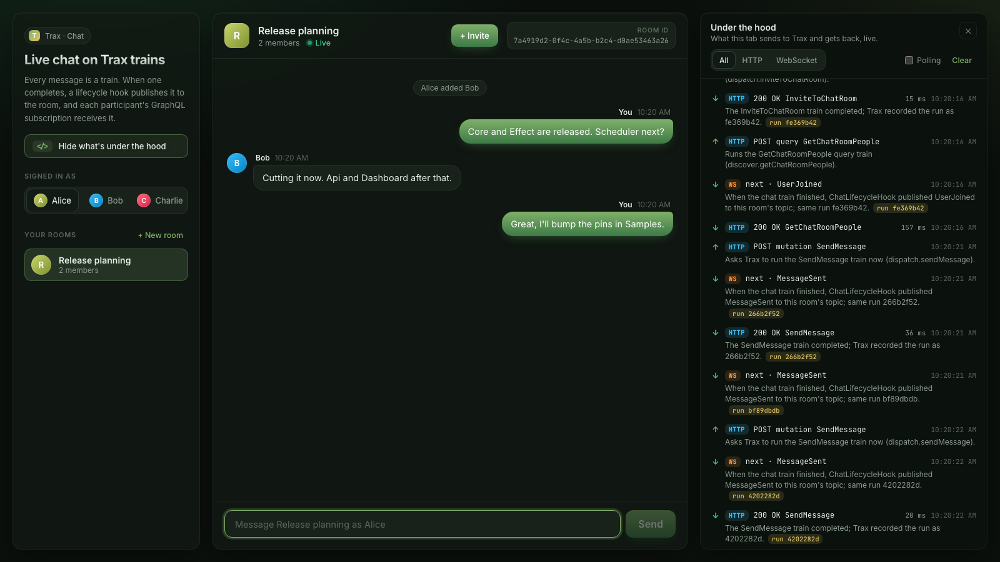

# Trax Chat Service Sample

A chat server whose messages arrive over GraphQL subscriptions. Chat mutations are Trax trains;
when one completes, a lifecycle hook publishes its output to a room-scoped topic, and every
participant subscribed with `onChatEvent(chatRoomId:)` receives it over a WebSocket.



## What it proves

- A custom subscription field on Trax's subscription root, `LifecycleSubscriptions`, fed by an
  `ITrainLifecycleHook` that sends to a HotChocolate topic when a chat train completes.
- Subscription authentication: the API key travels in the `connection_init` payload, and a socket
  without one is closed with `4403`.
- Per-subscriber authorization: `[TraxAuthorize]` on the field, plus a subscribe resolver that
  admits only the room's participants.
- Caller identity: every train is `[TraxAuthorize(Roles = "User")]` and reads the caller from
  `TraxPrincipal`. No input names the caller, so nobody can act as somebody else.
- Invites: `inviteToChatRoom` adds someone to a room, and only a member of the room may run it. The
  input names only who to add; the server takes their name from a `ChatDirectory` the host builds
  from the same list it registers credentials from. `getChatRoomPeople` lists who a member could add.
- Room-scoped events only: no chat train is `[TraxBroadcast]`. A broadcast train's `onTrainCompleted`
  carries every run's output to every caller the train admits, so it would show every user every
  room's messages. Trax's lifecycle subscriptions therefore refuse a chat user.

## Run

No Docker: Trax metadata and chat data are both SQLite files next to the API.

```bash
# The API, in Development, on http://localhost:5210
dotnet run --project samples/ChatService/Trax.Samples.ChatService.Api

# Optional: the React client on http://localhost:5173 (the only origin the API allows;
# Vite refuses to start if another sample's client already holds the port)
cd samples/ChatService/Trax.Samples.ChatService.Client
npm ci
npm run dev
```

Open two browser tabs on the client and pick Alice in one and Bob in the other. As Alice, create a
room and press **+ Invite** to add Bob: the room appears in Bob's list within a few seconds, marked
new, and the two of you can chat.

The client's **Under the hood** panel shows what each tab sends to Trax and gets back as it happens: every
GraphQL request and response, and every WebSocket frame. It follows a message from the mutation that runs its
`SendMessage` train to the `MessageSent` event `ChatLifecycleHook` publishes for that same run, matched by the run's
external id. The API key in `connection_init` is shown masked.

## Try it

The demo keys exist only in Development: `alice-key-do-not-use-in-production`,
`bob-key-do-not-use-in-production`, `charlie-key-do-not-use-in-production`.

```bash
G=http://localhost:5210/trax/graphql

# 1. Alice creates a room (note the chatRoomId)
curl -s $G -H 'Content-Type: application/json' -H 'X-Api-Key: alice-key-do-not-use-in-production' \
  -d '{"query":"mutation { dispatch { createChatRoom(input: { name: \"General\" }) { output { chatRoomId name } } } }"}'

ROOM=<chatRoomId>

# 2. Alice adds Bob (Bob could also join by the room's id himself, with joinChatRoom)
curl -s $G -H 'Content-Type: application/json' -H 'X-Api-Key: alice-key-do-not-use-in-production' \
  -d "{\"query\":\"mutation { dispatch { inviteToChatRoom(input: { chatRoomId: \\\"$ROOM\\\", userId: \\\"TraxApiKey:bob\\\" }) { output { userId displayName invitedByDisplayName } } } }\"}"
# {"data":{"dispatch":{"inviteToChatRoom":{"output":{"userId":"TraxApiKey:bob","displayName":"Bob","invitedByDisplayName":"Alice"}}}}}
```

3. Subscribe as Bob with any `graphql-ws` client, sending the key in the `connection_init`
   payload as `apiKey`. From Node, with the `graphql-ws` package the React client installs, save
   this as `subscribe.mjs` in the client folder and run `node subscribe.mjs $ROOM`:

   ```js
   import { createClient } from "graphql-ws";
   const client = createClient({
     url: "ws://localhost:5210/trax/graphql",
     connectionParams: { apiKey: "bob-key-do-not-use-in-production" },
   });
   client.subscribe(
     { query: `subscription { onChatEvent(chatRoomId: "${process.argv[2]}") { eventType payload } }` },
     { next: (m) => console.log(JSON.stringify(m)), error: console.error, complete: () => {} },
   );
   ```

```bash
# 4. Alice sends a message: Bob's subscription receives a MessageSent event
curl -s $G -H 'Content-Type: application/json' -H 'X-Api-Key: alice-key-do-not-use-in-production' \
  -d "{\"query\":\"mutation { dispatch { sendMessage(input: { chatRoomId: \\\"$ROOM\\\", content: \\\"Hello!\\\" }) { output { messageId senderUserId content } } } }\"}"

# 5. Charlie never joined: his history read is refused, and so is his subscription
curl -s $G -H 'Content-Type: application/json' -H 'X-Api-Key: charlie-key-do-not-use-in-production' \
  -d "{\"query\":\"{ discover { getChatHistory(input: { chatRoomId: \\\"$ROOM\\\" }) { messages { content } } } }\"}"
# "You are not a participant in room ..."

# 6. Bob's rooms
curl -s $G -H 'Content-Type: application/json' -H 'X-Api-Key: bob-key-do-not-use-in-production' \
  -d '{"query":"{ discover { getChatRooms { rooms { id name participantCount lastMessageAt } } } }"}'
```

## Tests

```bash
dotnet test tests/Trax.Samples.ChatService.Tests   # junctions and the hook, in-memory
dotnet test tests/Trax.Samples.ChatService.E2E     # the real host over HTTP and WebSocket, SQLite
```

## Docs

[Chat Service sample](https://traxsharp.net/docs/samples/chat-service) and
[Subscriptions](https://traxsharp.net/docs/sdk-reference/graphql-api/subscriptions).

> NO WARRANTY. The demo keys are plaintext constants for demonstration only; they are registered
> only in Development, and Trax refuses to start with them anywhere else.
