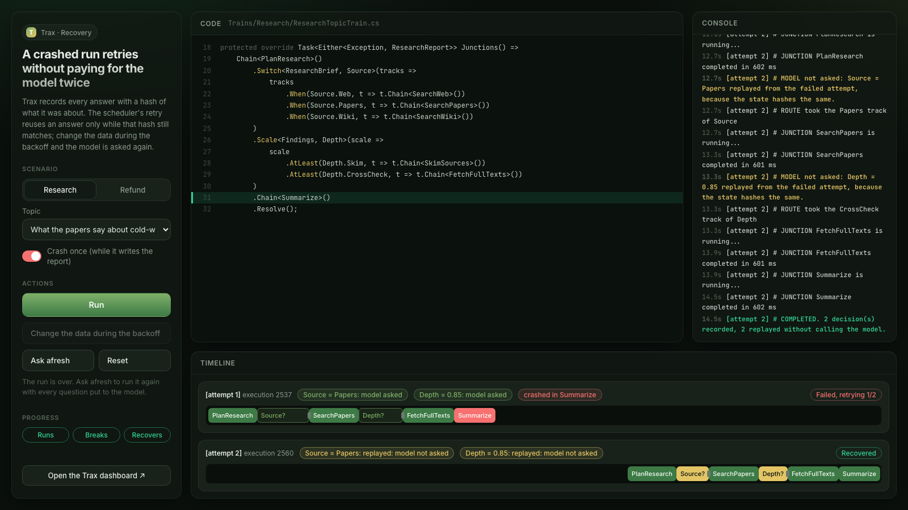

# Trax Recovery Sample

A live demo of a crashed run retrying without paying for its model's answers twice. A train asks a
decider (a stand-in model, or [Nimble](#using-nimble) running on your machine) which track to take, and Trax records each answer with a hash of the state
it was about. A later step crashes, and the manifest's automatic retry reuses the recorded answers
while that hash still matches, so it takes the same tracks. Every junction, question and track
reaches the page as it happens, through junction events. A third scenario, the topic map, runs three
similarity signals side by side in [parallel branches](#the-topic-map), crashes one, and draws each attempt
on the train's declared graph.



It proves three Trax features working together: [train decisions](https://traxsharp.net/docs/core/decisions),
[retries that replay decisions](https://traxsharp.net/docs/scheduler/dead-letters-and-cleanup#retries-replay-decisions)
and [junction events](https://traxsharp.net/docs/effect/junction-events). The full walkthrough is on
[traxsharp.net/docs/samples/recovery](https://traxsharp.net/docs/samples/recovery).

```
Recovery/
├── Trax.Samples.Recovery/          Trains, junctions, the demo decider, the fault injector, the topic map's corpus
├── Trax.Samples.Recovery.Api/      One host: GraphQL + scheduler + local workers + dashboard
└── Trax.Samples.Recovery.Client/   React 19 + Vite + Apollo + graphql-ws page
```

## Run it

Needs the .NET 10 SDK, Node.js 20 or later, and Docker. From the `Trax.Samples` folder:

```bash
docker compose up -d database          # Postgres 5432, database trax_recovery
dotnet run --project samples/Recovery/Trax.Samples.Recovery.Api
```

In a second terminal:

```bash
cd samples/Recovery/Trax.Samples.Recovery.Client
npm ci
npm run dev
```

Open http://localhost:5173. The host listens on http://localhost:5260; the dashboard is at
http://localhost:5260/trax and the GraphQL IDE at http://localhost:5260/trax/graphql, both in
Development only. When your Postgres is not on 5432, start the host with
`ConnectionStrings__TraxDatabase="Host=localhost;Port=<port>;Database=trax_recovery;Username=trax;Password=trax123"`.

## Try it

The page has the controls on the left, the train's real C# with the running step highlighted, a console that
narrates every junction event as it arrives, and a timeline with one lane per attempt, each with the attempt's
run graph (`operations.runGraph`) under it. The **Progress** pills
follow the run: **Runs**, **Breaks** when an attempt crashes, **Recovers** when the retry runs.

1. Leave **Research**, the first topic and **Crash once** selected and press **Run**. Attempt 1 runs
   `PlanResearch`, asks the model `Source` and `Depth`, takes the tracks they pick and crashes in `Summarize`
   while it writes the report. The sidebar counts down to the retry. A few seconds later the manifest's retry
   runs the train again: its lane reads **replayed: model not asked** for both questions, the console says
   `MODEL not asked`, and the retry takes the same tracks.
2. Pick **Refund**, order **A-1001**, and press **Run**. Attempt 1 asks `ApproveRefund` and crashes in
   `IssuePayment`. While the retry counts down, press **Change the data during the backoff**: it adds an
   earlier refund to the order, so the retry's state no longer hashes the same. The replay is refused, the
   model is asked again (**asked afresh: state changed**) and the refund goes to a person (the `Unsure` track)
   instead of being paid.
3. Press **Run** again and, during the countdown, press **Ask afresh**. The retry starts at once and asks the
   model again (**asked afresh: on purpose**).
4. Try orders A-1002 and A-1003. The model is unsure about A-1002 and declines A-1003, so their runs take the
   review and decline tracks; the step on that track crashes the same way, and the retry reuses the answer and
   takes the same track.
5. After a run completes, **Ask afresh** re-queues its last execution with
   `requeueExecution(id, askAfresh: true)`, as a run of its own: a lane labelled `[requeue]`.
6. Pick **Topic map**, leave **Crash once** on, and press **Run**. Attempt 1 loads the papers and runs three
   branches at once: `embedding`, `cocitation` and `authors`. The `cocitation` branch asks the model `SameTopic`
   and crashes in the step on the track it picks. The run fails naming `Parallel#0/cocitation`, and the join,
   `CombineSignals`, never runs, so nothing is written. The retry replays the answer and writes the map. The run
   graph under each lane shows the three branches side by side. The three slices on the picker take the gate's
   three tracks (`Yes`, `Unsure`, `No`).

The same over plain GraphQL, with header `X-Api-Key: recovery-operator-key-do-not-use-in-production`:

```graphql
mutation { dispatch { startRun(input: { scenario: REFUND, orderId: "A-1001", crashOnce: true }) {
  output { runId manifestId manifestExternalId } } } }

query { operations { executions(manifestId: 1, order: OLDEST) { items { id trainState failureJunction } } } }

query { operations { junctionRuns(metadataId: 42) { position kind name state answer replayed attempt } } }
```

## The topic map

`BuildTopicMapTrain` maps a slice of 28 made-up papers, shaped like works from a scholarly index (title,
abstract, year, authors, references, concepts), held in a `topic_map` schema. The host creates the schema and
adds the papers at startup, skipping any already there. No network calls.

```
LoadCorpus → Parallel ─┬─ embedding:  EmbeddingSimilarity           (bag-of-words cosine)
                       ├─ cocitation: CountSharedReferences → Gate<SameTopic> → Trust / Dampen / Ignore
                       └─ authors:    AuthorOverlap
           → CombineSignals (the join: the only step that writes, in one transaction)
           → FindHiddenTwins (papers that read alike but cite nothing in common)
```

Branches compute; the join commits. `Parallel` is experimental, so the project opts in with
`<NoWarn>$(NoWarn);TRAXEXP001</NoWarn>`. Over GraphQL:

```graphql
mutation { dispatch { startRun(input: { scenario: TOPIC_MAP, crashOnce: true, fromYear: 2016, toYear: 2025 }) {
  output { runId manifestId } } } }

query { operations { runGraph(metadataId: 42) {
  nodes { id kind state tracks { name taken nodes { id state } } } } } }
```

## Keys

Two demo keys, registered only in Development (a key carrying `do-not-use-in-production` refuses to
start anywhere else):

| Key | Role | Sees |
|---|---|---|
| `recovery-operator-key-do-not-use-in-production` | `Operator` | The operations view: every answer and every step name. The page uses it. |
| `recovery-viewer-key-do-not-use-in-production` | `Viewer` | The broadcast view of the research and refund trains: the run's shape, with answers and the steps on a track withheld. |

## Demo-only settings

The scheduler polls every second and retries after four seconds with no backoff growth, so a retry
is visible within seconds, and records two runs of its own each second; `AddMetadataCleanup` sweeps
those after ten minutes and keeps the scenario runs. `appsettings.Development.json` holds a fixed state hash key. Neither
belongs in production: keep the scheduler defaults, and keep the key with your other secrets.

Case files and armed crashes live in memory. A run started before the host restarts has lost its
case file, so every retry fails and the manifest dead-letters. A re-queue would fail the same way,
so the page offers no re-run once a run is dead.

## Using Nimble

Set `Recovery:Model` to `Nimble` and `Recovery:Nimble:Endpoint` to the full URL of a Nimble server's
`POST /v1/systemone` (one you run; Trax has no default). The demo decider is then not registered:

```bash
Recovery__Model=Nimble Recovery__Nimble__Endpoint=http://127.0.0.1:8000/v1/systemone \
  dotnet run --project samples/Recovery/Trax.Samples.Recovery.Api
```

### On a Mac

Nimble's own server (`nimble/serving/server.py`) runs SGLang and needs an NVIDIA GPU. On Apple Silicon,
[`nimble-mac/serve.py`](nimble-mac/serve.py) serves the same model through Nimble's MLX scorer on
`http://127.0.0.1:8000/v1/systemone`, answering in the shape `AddNimbleDecider` reads. It needs Python 3.12,
about 40 GB of disk, and enough memory for an 18 GB model (it was run on an M3 Pro with 36 GB). From a
folder beside `Trax.Samples`:

```bash
git clone https://github.com/bespokelabsai/nimble.git
cd nimble

# Download the model and merge it, once.
python3.12 -m venv .cache/venvs/nimble
.cache/venvs/nimble/bin/python -m pip install torch==2.8.0 -r requirements/training.txt huggingface_hub
.cache/venvs/nimble/bin/python ../Trax.Samples/samples/Recovery/nimble-mac/prepare.py

# Serve it.
python3.12 -m venv .venv-mlx
.venv-mlx/bin/python -m pip install -r requirements/mlx.txt fastapi uvicorn
.venv-mlx/bin/python ../Trax.Samples/samples/Recovery/nimble-mac/serve.py
```

[`prepare.py`](nimble-mac/prepare.py) is the "Download the model" step of Nimble's README: it downloads
`bespokelabs/Bespoke-Nimble-9B`, a LoRA adapter, and the Qwen3.5-9B base revision the adapter pins (about
18 GB) from Hugging Face, merges them once on the CPU, and writes the merged weights to `.cache/models/`. The
server then answers one request at a time, about a second a question on an M3 Pro, and logs each answer.
Nothing leaves the machine.

A real model reads the case, so its answers differ from the demo decider's. Nimble paid A-1001 (0.99), and
after **Change the data during the backoff** added an earlier refund it was asked again and declined (0.13)
where the demo decider sends the refund to review. Its latest release ships no fitted probability
temperature, so it is served at 1.0; the gate's bars (pay at 0.8 or above, decline below 0.3) were chosen for
the demo decider, not checked against Nimble.

## Tests

`tests/Trax.Samples.Recovery.E2E` runs the real host against Postgres (database
`recovery_e2e_tests`) with a counting decider:

```bash
TRAX_TEST_PG_PORT=5432 dotnet test tests/Trax.Samples.Recovery.E2E
```
