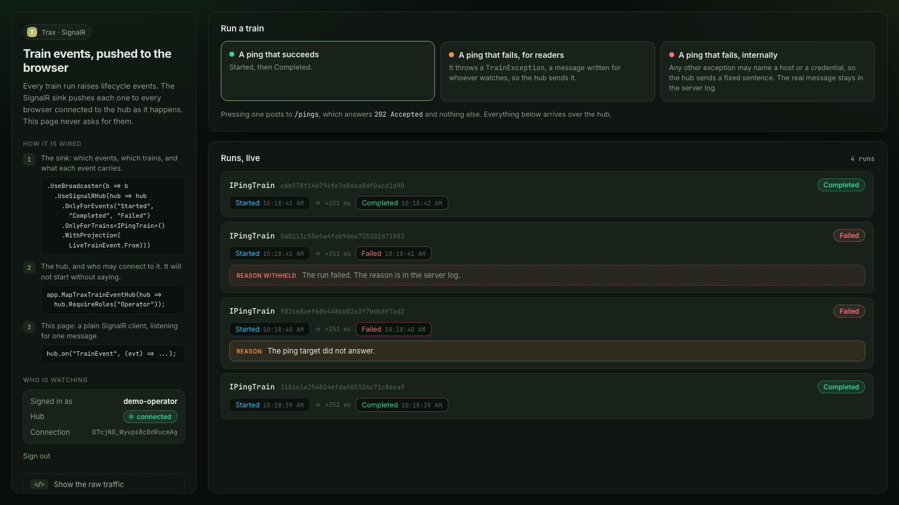

# SignalRBroadcaster: live train events in a browser

The Trax SignalR sink pushes each train's lifecycle events (Started, Completed, Failed) to the
clients connected to a hub. This sample is one process with one train, a browser page that shows the
events as they happen, and a hub that only signed-in operators may join.



What it proves:

- `UseBroadcaster(b => b.UseSignalRHub(...))` plus `MapTraxTrainEventHub(...)` is all the server
  needs; the page is a plain JavaScript SignalR client listening for `TrainEvent`.
- The hub refuses a client that is not signed in (`401` on negotiate). It sends every train's events
  to every client it admits, which is why `MapTraxTrainEventHub` will not start without a posture.
  Here the posture is `RequireRoles("Operator")`, and the browser's sign-in cookie is the credential:
  it rides the negotiate request and the WebSocket upgrade with no client code.
- The default payload carries no failure reason, because the reason is the failing code's exception
  message and every admitted client sees it. The sample's own projection (`LiveTrainEvent`) sends the
  reason only for a `TrainException`, the type a train author throws for a message meant to be read,
  and a fixed sentence for anything else.
- The demo sign-in exists only in Development; anywhere else nobody can join the hub until you add
  a real sign-in.

Effects are in memory, so it needs no database.

> `Workarounds/SignalRSinkKeepAlive.cs` works around a Trax.Effect defect that silences the sink
> after the first train run. It is temporary and not part of the pattern; do not copy it.

## Run

From `Trax.Samples/`:

```bash
dotnet run --project samples/SignalRBroadcaster/Trax.Samples.SignalRBroadcaster
```

Open <http://localhost:5270>.

## Try it

1. Press **Try to connect without signing in**: the hub's negotiate request answers `401`, and no connection
   opens. Then press **Sign in as the demo operator**; the page connects to `/hubs/trax-events`.
2. Press **A ping that succeeds**: a run card appears and fills in live, `Started` then `Completed`, with the time
   between them.
3. Press **A ping that fails, for readers**: the run fails with a `TrainException`, and its card shows the reason
   `The ping target did not answer.`
4. Press **A ping that fails, internally**: the card shows the reason withheld,
   `The run failed. The reason is in the server log.`, and the server's console shows the real message.

**Show the raw traffic** lists what the page sends and every `TrainEvent` the hub pushes. `POST /pings` answers
`202 Accepted` and nothing else: the run's events reach the page over the hub.

Without signing in, `curl -i -X POST http://localhost:5270/pings` and
`curl -i -X POST "http://localhost:5270/hubs/trax-events/negotiate?negotiateVersion=1"` both answer `401`.

## Tests

```bash
dotnet test tests/Trax.Samples.SignalRBroadcaster.E2E
```

A .NET SignalR client joins the hub through `WebApplicationFactory`: refused without the cookie,
admitted with it, and receiving the live events and the projected failure reasons.

Docs: <https://traxsharp.net/docs/samples/signalr-broadcaster>
